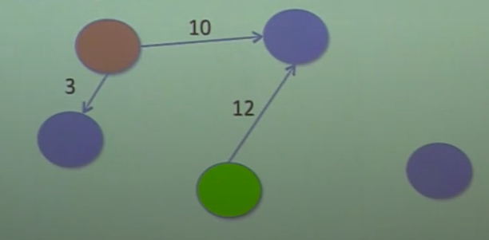

# Lecture 3: Graph-theoretic Models

## What is a graph?

- **Nodes** (vertices):
    - Might have *properties* associated with them. 
- **Edges** (arcs): Connections between **Nodes**.
    - Allows sharing of information between two **Nodes**.
    - **Undirected** (graph)
        - Goes both ways, sharing of information.
    - **Directed** (digraph)
        - Source (parent) and destination (child) nodes.
    - Unweighted or weighted.
        - *Costs* of traversal from one node to the next.
    

## Leonhard Euler's Model

- Each island is a node.
- Each bridge an undirected (travel is possible in both directions) edge.
- Model abstracts away irrelevant details:
    - Size of islands.
    - Length of bridges.
- Is there a path that contains each edge exactly once?
    - No!


## Class Node

```py
class Node(object):
    def __init__(self, name):
        self.name = name
    
    def getName(self):
        return self.name
    def __str__(self):
        return self.name
```

## Class Edge

```py
class Edge(object):
    def __init__(self, src, dest):
        """Assumes src and dest are Node objects."""
        self.src = src
        self.dest = dest
    def getSource(self):
        return self.src
    def getDestination(self):
        return self.dest
    def __str__(self):
        return self.src.getName() + '->' + self.dest.getName()
```


## Find the Shortest Path

1. Depth-first Search (DFS):
    - Start at an initial node. 
    - Consider all the edges that leave that node, in some order. 
    - Follow the first edge, and check to see if at "goal/target" node.
    - If not, repeat the process from new node.
    - Continue until either find goal node, or run out of options.
        - When run out of options, backtrack to the previous node and try the next edge, repeating this process.

2. Breadth First Search
    - Start at an initial node.
    - Consider all the edges that leave the node, in some order.
    - Follow the first edge, and check to see if att goal node.
    - If not, try the next edge from the current node.
    - Continue until either find goal node, or run out of options.  
        - When run out of edge options, move to next node at same distance from start, and repeat.
        - When run out of node options, move to next level in the graph (all nodes one step further from start), and repeat.