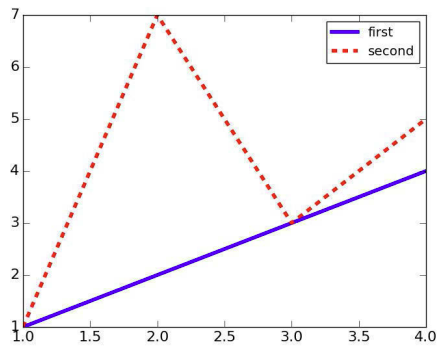

# Lecture 5: Random Walks

## Why Random Walks?
- Important in many domains:
    - Understanding the stock market (maybe)
    - Modeling diffusion processes
    - Etc.

## Drunkard's Walk

## Pylab
- Numpy: Adds vectors, matrices, and many high-level mathematical functions.
- Scipy: Adds mathematical classes and functions useful to scientists.
- MatPlotLib: Adds an object-oriented API for plotting.
- Pylab: Combines the other libraries to provide a MATLAB-like interface.

### MatPlotLib
- `plot`: Plotting object used to create plots in Python.
    - The first two arguments to `pylab.plot` must be sequences of the same length.
    - First argument gives x-coordinates.
    - Second argument gives y-coordinates.
    - Many optional arguments.
    - Points plotted in order. In default style, as each point is plotted, a line is drawn connecting it to the previous point.

```py
import pylab

xVals = [1, 2, 3, 4]
yVals1 = [1, 2, 3, 4] 
pylab.plot(xVals, yVals1, 'b-', label = 'first')
yVals2 = [1, 7, 3, 5]
pylab.plot(xVals, yVals2, 'r--', label = 'second')
pylab.legend() 
```
