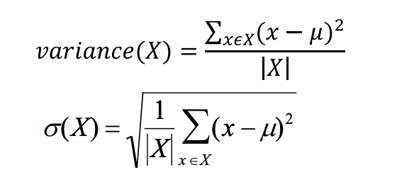
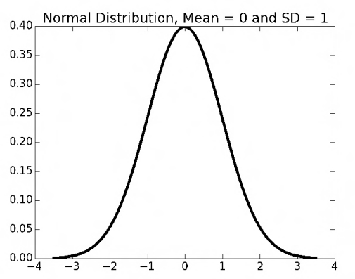

# Lecture 6: Monte Carlo Simulation

## Monte Carlo Simulation
- Monte Carlo Simulation: A method of estimating the value of an unknown quantity using the principles of inferential statistics.
    - Inferential Statstics:
        - Population: a set of examples
        - Sample: a proper subset of a population
        - Key Fact: A *random sample* tends to exhibit the same properties as the population from which it is drawn.
    - Exactly what we did with **random walks** in Lecture 5.

- As **variance** grows, we need larger samples to have the same degree of confidence.

- Law of Large Numbers: In repeated independent tests with the same actual probability *p* of a particular outcome in each test, the chance that the fraction of times that outcome occurs differs from *p* converges to zero as the number of trials goes to infinity.
    - As you do more and more trials, the observed frequency (how often the outcome happens) will get closer and closer to the true probability.

## Regression to the Mean 
- Following an extreme random event, the next random event is likely to be less extreme.
- If you spin a fair roulette wheel 10 times and get 100% reds, that is an extreme event (probability = 1/1024).
- It is likely that in the next 10 spins, you will get fewer than 10 reds (regress back to the mean).
    - But the expected number is only 5. Each event is independent and 50/50 red vs. black.

## Sampling Space of Possible Outcomes
- Neve possible to guarantee perfect accuracy through sampling
- Not to say that an estimate is not percisely correct.
- Key Question:
    - How many sample do we need to look at before we can have justified confidence on our answer.
- Depends upon variability in underlying distribution.

## Quantifying Variation in Data

- Standard Deviation is simply the square root of the variance.
- Outliers can have big effect.
- Standard Deviation should always be considered relative to mean.

## Confidence Levels and Intervals
- Instead of estimating an unknown parameter by a single
value (e.g., the mean of a set of trials), a confidence interval
provides a range that is likely to contain the unknown value
and a confidence that the unknown value lays within that
range.
- Example:
    - "The return on betting a pocket 10k times in European Roulette is **-3.3%**. The margin of error is +/- 3.5% with a 95%
level of confidence.

## Empirical Rule
- Under some assumptions discussed later:
    - ~68% of data within one standard deviation of mean.
    - ~95% of data within 1.96 standard deviations of mean.
    - ~99.7% of data within 3 standard deviations of mean .
- Assumptions:
    - The mean estimation error is zero.
    - The distribution of the errors in the estimates is normal.
    

## Defining Distributions
- Use a probability distribution.
- Captures notion of relative frequency with which a random variable takes on certain values.
    - Discrete random variables drawn from finite set of values.
    - Continuous random variables drawn from reals between two numbers.
    