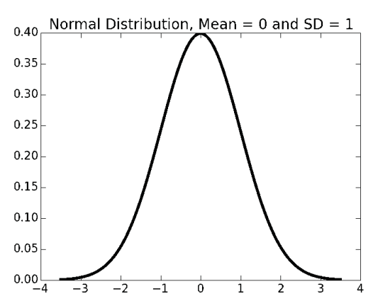

# Lecture 7: Confidence Intervals

## Assumptions Underlying Empirical Rule
- The mean estimation error is zero.
- The distribution of the errors in the estimates is normal (Gaussian).

## Probability Density Functions
- Distributions