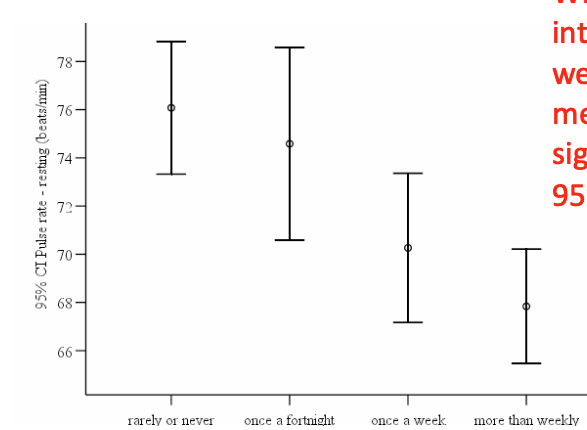
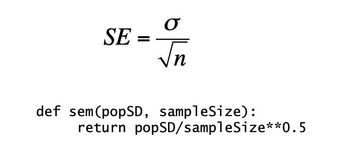

# Lecture 8: Sampling and Standard Error

- Inferential Statistics: Making inferences about a populations by examining one or more random samples drawn from that population.

- Probability Sampling: Each member of the population has a nonzero probability of being included in a sample.

- Simple Random Sampling: Each member has an equal chance of being chosen.

- Stratified Sampling: Partition population into subgroups and take a simple random sample from each subgroup.
    - Used when:
        - There are small subgroups that should be sampled.
        - It is important that subgroups be represented proportionally to their size in the population.
        - Can be used to reduce the needed size of sample.
            - Variablility of subgroups less than of entire population.

- Error Bar, a Digression: Graphical representation of the variability of data.
    - Way to visualize uncertainty.
    - If confidence intervals DO overlap you cannot conclude that there is no statistically significant difference.
    - If confidence intervals DO NOT overlap you can conclude that there is a statistically significant difference.

- Central Limit Theorem
    - Given a sufficiently large sample:
        1. The means of the samples in a set of sample (the sample means) will be approximately normally distributed.
        2. This normal distribution will have a mean close to the mean of the population.
        3. The variance of the sample means will be close to the variance of the population divided by the sample size.
    
- Standard Error of the Mean: A measure of how much the sample mean is expected to vary from the true population mean.

- Skew: A measure of the asymmetry of a probability	distribution.