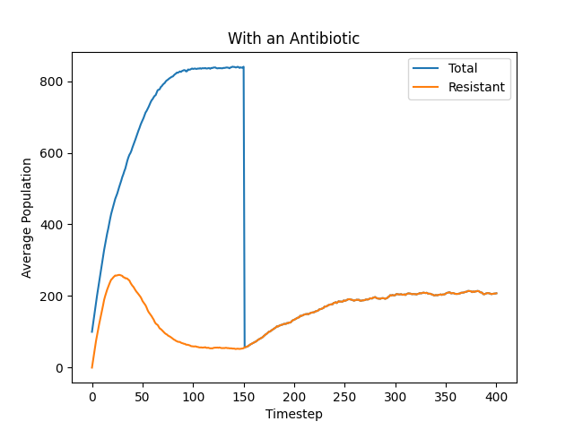
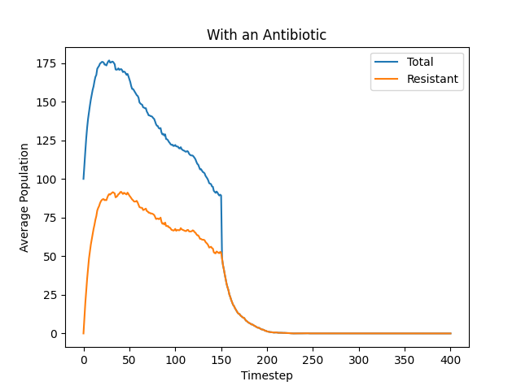

# Problem #2

# Problem #3

The return value for the `calc_95_ci` for the `simulation_without_antibiotic` results, `populations` is `(763.1, 4.239494045284177)`.

The mean at the **299** index is 763.1.

The 95% confidence interval is ~4.24.

# Problem #5

## A

The 95% confidence interval for the `total_pop` is ~7.19.

The 95% confidence interval for the `resistant_pop` is ~7.19.

## B

The 95% confidence interval for the `total_pop` is 0.

The 95% confidence interval for the `resistant_pop` is 0.

This is reflected and confirmed by the charts because after step 150 (antibiotic administration to the patient) the non-resistant bacteria die over time rapidly, leaving only the resistant bacteria. The lines converge and become the same, reading only the living resistant bacteria. 

# Problem #6

1. 
    A. In simulation A, the birth rate is higher than the death rate and the population grows rapidly to start. The population density slows the growth as it reaches the population limit.

    B. In simulation B, the total population is increased by a large number mutant offspring to start. The total population begins to decrease as the death rate is larger than the birth rate.

2. 
    A. In simulation A, due to a rapid initial increase in population density, the rate of appearance of new resistant mutants decreases.

    B. In simulation B, almost all new bacteria are mutant and have resistance. The death rate being greater than the birth rate causes the resistant bacteria to fall gradually as more die than are being born.

3. After the antibiotic is administered to the patient, the total population of bacteria in both simulations falls almost instantly—a near 90-degree slope—to the resistant bacteria level, leaving only the resistant bacteria remaining.

4. 
    A. In simulation A, the resistant bacteria begin to increase again due to the birth rate being greater than the death rate and the low population density. It reaches a plateau or slowly increases as the population density increases and the death rate is fairly close to the birth rate.

    B. In simulation B, the resistant bacteria fall rapidly because the death rate is greater than the birth rate, meaning that more bacteria are dying than are reproducing.
